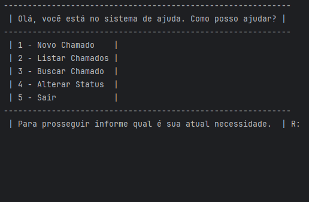
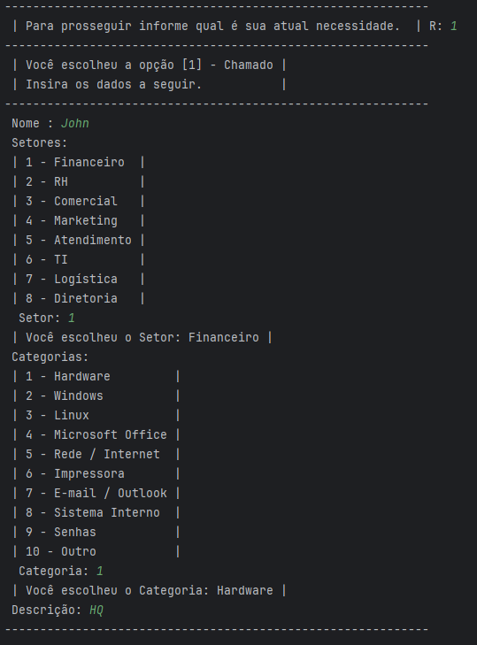
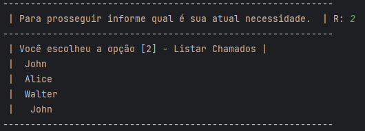
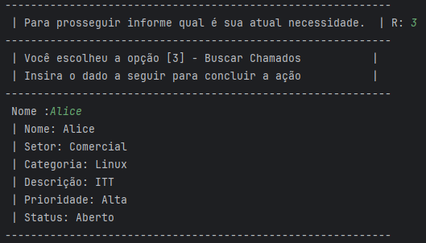
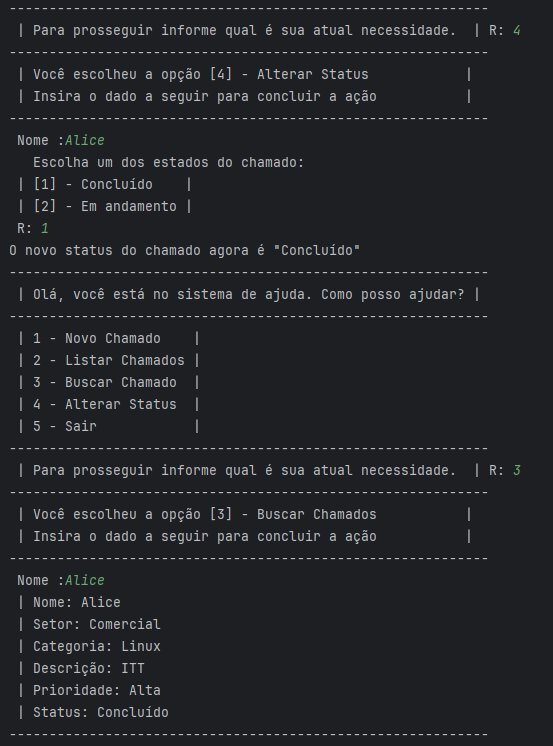

# 📌 Help Desk Ticket System

## 📖 Description

A Python application that simulates a Help Desk environment, allowing users to create, search, update, and manage technical support tickets.

## 🎯 Purpose

- Practice Python programming
- Strengthen data structure fundamentals
- Simulate a real-world Help Desk ticket management system

## ⚙️ Features

- Create tickets
- Search for tickets
- List all tickets
- Update ticket status
- Save data to JSON
- Automatically load saved data

## 📸 Screenshots

### Main Menu



### Creating a Ticket



### Searching for a Ticket



### Listing Tickets



### Updating Ticket Status


### Updated Ticket



## 🛠️ Technologies Used

- Python 3
- Standard library `json`
- Standard library `os`

## 📚 Concepts Practiced

### Python

- Variables
- Conditional statements
- Loops (`for` and `while`)
- Lists
- Dictionaries
- File handling
- JSON serialization

### Software Development

- CRUD operations
- Interactive command-line menus
- Code organization
- Data persistence

## 🚀 Getting Started

1. Clone this repository.
2. Open a terminal.
3. Run the application:

```bash
python "Sistema de Chamadas.py"
```

## 📂 Project Structure

```text
Help Desk Ticket System/
│
├── Sistema de Chamadas.py
├── chamados.json
└── README.md
```

## 🔮 Future Improvements

- User registration
- Automatic ticket ID generation
- Ticket deletion
- Graphical user interface (Tkinter)
- SQLite database integration
- Administrator login
- Exception handling (`try`/`except`)
- Code modularization
- Search by ID
- Search by status

## 👤 Author

**Guilherme "Mogogu" Gomes**

- LinkedIn: https://linkedin.com/in/mogogu-it/
- GitHub: https://github.com/Mogogu

## 💡 What I Learned

While developing this project, I practiced building interactive command-line menus, working with lists and dictionaries, persisting data using JSON, searching and updating records, and organizing Python code into a maintainable structure.